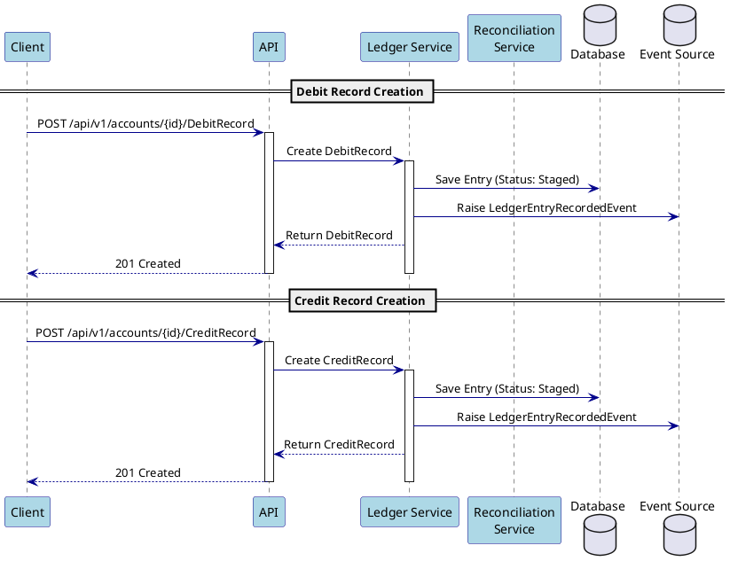

# Data Flow

## Posting a Ledger Entry

```plantuml 
@startuml
skinparam backgroundColor white
skinparam sequenceMessageAlign center
skinparam sequence {
    ParticipantBackgroundColor LightBlue
    ParticipantBorderColor DarkBlue
    ArrowColor DarkBlue
}

participant "Client" as C
participant "API" as A
participant "Ledger Service" as L
participant "Reconciliation\nService" as R
database "Database" as D
database "Event Source" as E

== Debit Record Creation ==
C -> A: POST /api/v1/accounts/{id}/DebitRecord
activate A
A -> L: Create DebitRecord
activate L
L -> D: Save Entry (Status: Staged)
L -> E: Raise LedgerEntryRecordedEvent
L --> A: Return DebitRecord
A --> C: 201 Created
deactivate A
deactivate L

== Credit Record Creation ==
C -> A: POST /api/v1/accounts/{id}/CreditRecord
activate A
A -> L: Create CreditRecord
activate L
L -> D: Save Entry (Status: Staged)
deactivate R
L -> E: Raise LedgerEntryRecordedEvent
L --> A: Return CreditRecord
A --> C: 201 Created
deactivate A
deactivate L

@enduml
```