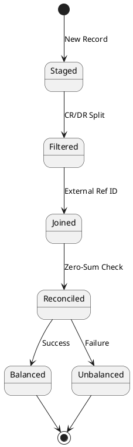

# Ledger Entry System

## Overview

The ledger entry system implements a double-entry bookkeeping system with stream-based
processing and reconciliation. It handles credit and debit records through a series
of stream processing stages that ensure proper pairing and balance verification.

## Entry Types

### Ledger Record
- Initial entry point for all transactions
- Contains account ID, external reference ID, amount, and CR/DR indicator
- Represents the raw transaction before processing

### DebitRecord
- Filtered from initial ledger record
- Keyed by external reference ID
- Contains account ID and debit amount
- Awaits matching credit record for reconciliation

### CreditRecord
- Filtered from initial ledger record
- Keyed by external reference ID
- Contains account ID and credit amount
- Participates in reconciliation process

## Stream Processing Stages

1. **Initial Record (ledger-record)**
   - Entry point for all transactions
   - Key: account ID
   - Contains: external-ref-id, amount, cr/dr indicator

2. **Filter Stage (ledger-filter)**
   - Splits records into credit and debit streams
   - Routes based on cr/dr indicator
   - Maintains all original transaction data

3. **Separated Records (ledger-debit-record, ledger-credit-record)**
   - Records are re-keyed by external reference ID
   - Maintains account ID and amount information
   - Prepared for joining process

4. **Join Stage (ledger-join)**
   - Matches credit and debit records by external reference ID
   - Accumulates records until pairs are complete
   - Forwards complete pairs for reconciliation

5. **Reconciliation Stage (ledger-reconciliation)**
   - Performs zero-sum verification
   - Routes records to appropriate outcome streams
   - Handles both successful and failed reconciliations

6. **Final States**
   - Balanced: Successfully reconciled pairs
   - Unbalanced: Failed reconciliation cases

## Status Flow

- **Staged**: Initial state in ledger-record
- **Filtered**: After CR/DR separation
- **Joined**: Paired in join stage
- **Reconciled**: Zero-sum verified
- **Balanced**: Successfully matched and verified
- **Unbalanced**: Failed verification

## Important Characteristics

1. **Stream Processing**
   - Event-driven architecture
   - Stateful processing for joins
   - Deterministic record routing

2. **Keying Strategy**
   - Initial routing by account ID
   - Join processing by external reference ID
   - Maintains transaction context throughout

3. **Balance Verification**
   - Zero-sum validation for paired records
   - Automatic routing based on verification results
   - Clear separation of balanced and unbalanced outcomes

4. **Error Handling**
   - Unbalanced records captured for investigation
   - Clear error state identification
   - Maintains original transaction context

## Data Flow

## Processing Guarantees

1. **Exactly-Once Processing**
   - Stream processing ensures no duplicates
   - Stateful operations maintain consistency
   - Deterministic outcomes for identical inputs

2. **Order Preservation**
   - External reference ID maintains pairing
   - Time-based processing within stages
   - Consistent state transitions

3. **Error Recovery**
   - Clear error states
   - Maintained transaction context
   - Investigate-able unbalanced outcomes

## Monitoring Considerations

- Stream lag metrics per stage
- Join completion rates
- Balance verification success rates
- Unbalanced record monitoring
- Processing latency per stage
