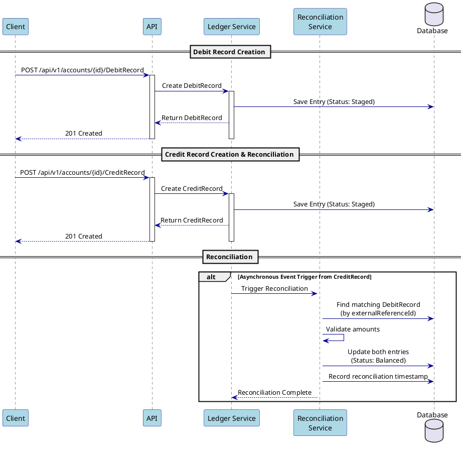

# Ledger Entry System

## Overview

The ledger entry system implements a double-entry bookkeeping system with asynchronous
reconciliation. It handles two types of entries: `DebitRecord` and `CreditRecord`, which
are designed to work in pairs through a reconciliation process.

## Entry Types

### DebitRecord

- Represents a debit entry in the ledger
- Created immediately when a debit transaction occurs
- The initial status is "Staged"
- Remains unreconciled until a matching CreditRecord is processed
- Identified by a unique external reference ID

### CreditRecord

- Represents a credit entry in the ledger
- Triggers an asynchronous reconciliation workflow
- Must match with a corresponding DebitRecord
- Uses the same external reference ID as its matching DebitRecord
- Initiates the reconciliation process automatically

## Reconciliation Process

When a CreditRecord is created, the system:

1. Searches for the matching DebitRecord using the external reference ID
2. Validates the amount of the record match
3. Updates the status of both records to "Balanced"
4. Records reconciliation timestamp and user

## Status Flow

- **Staged**: Initial status for new entries
- **Unbalanced**: Entry waiting for its matching pair
- **Balanced**: Successfully reconciled with matching entry
- **Error**: Reconciliation failed or other issues detected
- **HotArchive**: Recent reconciled records
- **ColdArchive**: Old reconciled records
- **ForDeletion**: Marked for removal

## Sequence Diagram

## Important Characteristics

1. **Immutability**
    - Entries are never modified after creation
    - Status changes are tracked and audited
    - All changes maintain historical records

2. **Pairing**
    - Each DebitRecord must have a matching CreditRecord
    - Matching is done through external reference IDs
    - Both records must have matching amounts

3. **Asynchronous Processing**
    - Reconciliation happens asynchronously
    - System can handle high volumes of transactions
    - Eventual consistency is guaranteed

4. **Audit Trail**
    - All entries maintain creation timestamps
    - Reconciliation timestamps are recorded
    - Creator and reconciler information is preserved

## Data Retention

- Active records remain in the main tables
- Reconciled records are moved to hot archive after a period
- Old records are moved to cold archive for long-term storage
- Records marked for deletion are handled by cleanup processes