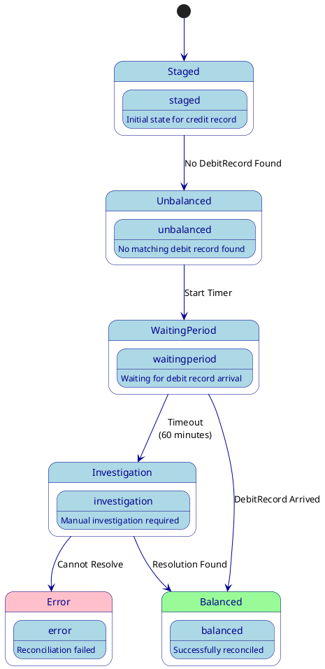

# Handling Missing Debit Records

## Overview

In a double-entry bookkeeping system, there are scenarios where a CreditRecord might arrive before its corresponding
DebitRecord. This document outlines the strategies and processes for handling such cases.

## Detection Mechanisms

### 1. Immediate Detection

- When a CreditRecord arrives, the reconciliation service immediately attempts to find its matching DebitRecord
- If no matching DebitRecord is found, the CreditRecord is marked as "Unbalanced"
- The system logs this as a potential missing debit scenario

### 2. Periodic Scanning

- A scheduled job runs at configurable intervals (default: hourly)
- Identifies CreditRecords that remain unbalanced beyond a configured threshold time
- Generates reports for monitoring and alerting

## Handling Strategy

### Phase 1: Initial Wait Period

1. **Initial Receipt**
    - System accepts the CreditRecord
    - Marks it as "Unbalanced"
    - Starts a wait timer (default: 60 minutes)

2. **During Wait Period**
    - System continues normal reconciliation attempts
    - Monitors for arrival of matching DebitRecord
    - No alerts are generated during this period

### Phase 2: Investigation

When a DebitRecord remains missing after the wait period:

1. **Alert Generation**
    - System generates alerts to configured channels
    - Includes transaction details and timing information
    - Marks the record for investigation

2. **Automatic Investigation**
    - Checks for similar transactions patterns
    - Validates external reference ID format
    - Verifies account status and permissions

3. **Manual Investigation Triggers**
    - Creates investigation ticket in configured system
    - Notifies relevant teams
    - Provides audit trail of attempted reconciliation

## Resolution Paths

### 1. Normal Resolution

- Missing DebitRecord arrives naturally
- System performs standard reconciliation
- Records are marked as "Balanced"

### 2. Manual Resolution

- Investigation confirms legitimate missing DebitRecord
- System allows manual creation of matching DebitRecord
- Special audit flags are set for tracking
- Requires elevated permissions

### 3. Error Resolution

- Investigation reveals invalid CreditRecord
- Record is marked as "Error"
- Compensating entries may be required

## Monitoring and Reporting

### 1. Real-time Monitoring

- Dashboard showing unbalanced transactions
- Age distribution of unresolved items
- Alert status and investigation progress

### 2. Periodic Reports

- Daily summary of missing debit records
- Resolution success rates
- Average resolution time metrics
- Pattern analysis for preventive measures

## Prevention Strategies

1. **Source System Validation**
    - Implement pre-validation at source
    - Verify transaction sequences
    - Check for system connectivity issues

2. **Circuit Breakers**
    - Monitor failure rates
    - Implement temporary holds on problematic sources
    - Automatic scaling of wait periods based on system load

3. **Pattern Detection**
    - Analysis of common failure scenarios
    - Automated adjustment of monitoring parameters
    - Predictive alerting based on historical patterns

## Configuration Parameters

| Parameter                    | Default | Description                                 |
|------------------------------|---------|---------------------------------------------|
| `wait.period.minutes`        | 60      | Initial wait time before investigation      |
| `retry.interval.seconds`     | 300     | Time between reconciliation attempts        |
| `alert.threshold.count`      | 100     | Number of missing records before escalation |
| `investigation.auto.enabled` | true    | Enable automatic investigation              |

## Audit Requirements

All actions related to missing debit records must maintain:

1. Complete timeline of detection and resolution
2. All attempted reconciliation timestamps
3. Investigation notes and findings
4. Resolution method and authorizing user
5. Any system-generated compensating entries