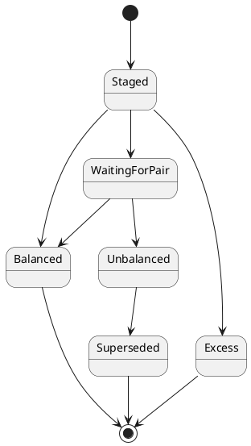
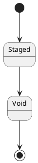

# Reconciliation of double entry records

## Ledger Record Status Lifecycle



### Happy Path

```plantuml
[*] --> Staged
Staged --> WaitingForPair
Staged --> Balanced
WaitingForPair --> Balanced
Balanced --> [*]
@enduml
```

### Excess Path

```plantuml
[*] --> Staged
Staged --> Excess: Records are already Balanced
Excess --> [*]
@enduml
```

### Unbalanced Path

There are 2 entries required to correct with an unbalanced path.

It should create 2 entries which should typically correct an unbalanced record pair.

1. Create a *Void of the record to be corrected
2. Create A *Correction of the record with the right amount
3. Mark the original as Superseded
4. Re-balance of the transactions

#### Creating a *Void of the record to be corrected

This Void record pairs with a DebitRecord or a CreditRecord.



#### Set the record status of the parent as Void

The original record sets the record status to Void.

```plantuml
[*] --> Staged
Staged --> WaitingForPair
WaitingForPair --> Unbalanced: Amounts do not match
Unbalanced --> Void: A *Correction is recorded
Void --> [*]
@enduml
```

#### Creating a *Correction of the record with the right amount

This Correction records pairs with the unbalanced DebitRecord or CreditRecord.

```plantuml
[*] --> Staged
Staged --> CRDRCorrection
CRDRCorrection --> Balanced
Balanced --> [*]
```
