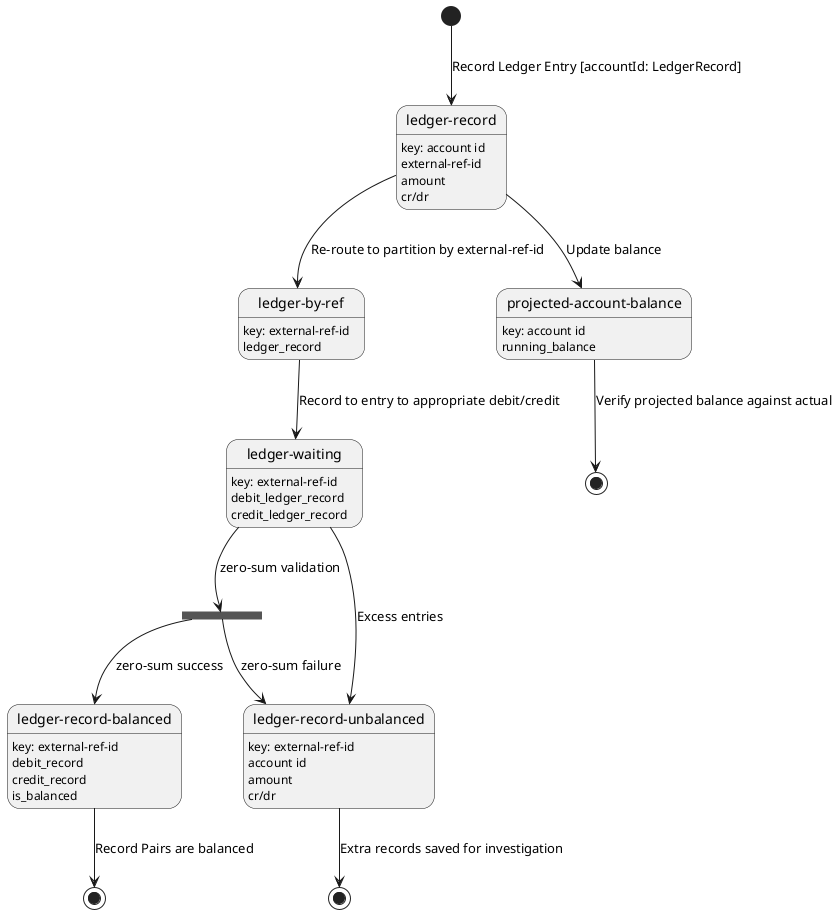

# Ledger Topology

In this document we describe how records are processed in each node of the stream topology.

## Stream Architecture

```plantuml
@startuml

state "ledger-record" as stage
state "ledger-by-ref" as stream_ref
state "ledger-waiting" as table_wait
state "ledger-reconciliation" as fork_zero_sum <<fork>>
state "ledger-record-balanced" as balanced
state "ledger-record-unbalanced" as unbalanced
state "balanced" as happy_path <<end>>
state "unbalanced" as unhappy_path <<end>>

state "projected-account-balance" as proj_bal
state "updated-balance" as upd_bal <<end>>

stage: key: account id
stage: external-ref-id
stage: amount
stage: cr/dr

stream_ref: key: external-ref-id
stream_ref: ledger_record

table_wait: key: external-ref-id
table_wait: debit_ledger_record
table_wait: credit_ledger_record

balanced: key: external-ref-id
balanced: debit_record
balanced: credit_record
balanced: is_balanced

unbalanced: key: external-ref-id
unbalanced: account id
unbalanced: amount
unbalanced: cr/dr

proj_bal: key: account id
proj_bal: running_balance

[*] --> stage: Record Ledger Entry [accountId: LedgerRecord]
stage --> stream_ref: Re-route to partition by external-ref-id
stream_ref --> table_wait: Record to entry to appropriate debit/credit
table_wait --> fork_zero_sum: zero-sum validation
fork_zero_sum --> balanced: zero-sum success
fork_zero_sum --> unbalanced: zero-sum failure
table_wait --> unbalanced: Excess entries

balanced --> happy_path: Record Pairs are balanced
unbalanced --> unhappy_path: Extra records saved for investigation

stage --> proj_bal: Update balance
proj_bal --> upd_bal: Verify projected balance against actual

@enduml
```